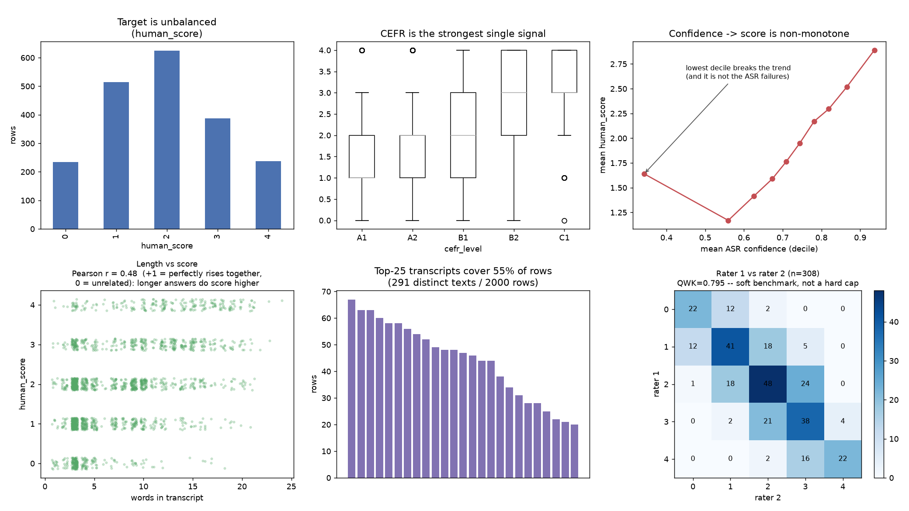
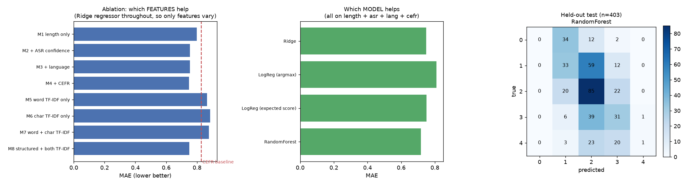

# Automated learner-response scoring

**Status:** Parts 1–2 complete. Part 3 (transformer) not yet run.

```bash
uv sync
uv run python solution/part1_analysis.py    # EDA    -> figures/part1_overview.png
uv run python solution/part2_classical.py   # models -> figures/part2_models.png
```

`common.py` holds the data, features, splits and metrics shared by all parts, so
Part 3 will be scored on the same folds and the same held-out rows.

---

## 1. What the data forced me to do

**Only 291 distinct transcripts back the 2,000 rows; 94% of rows share their text
with another row.** To size the risk I built a probe that cannot generalise at
all — it memorises each training transcript's mean score and looks it up.

| split | test rows found in lookup table | QWK |
|---|---|---|
| random 5-fold | 93.0% | 0.417 |
| grouped by transcript | 0.0% | 0.000 |

Grouped, the probe finds nothing, predicts a constant, and scores 0 — correct for
a model that learned nothing. Random, it scores 0.417, in the range a genuine
model reaches here. **A random split pays real-looking scores for pure
memorisation, so every split in this submission is grouped on the transcript.**

**Identical text gets different scores.** Of 173 repeated transcripts, only 14
were scored consistently; 19 span the full 0–4 range. `j'aime le foot` appears 63
times, scored 0 sixteen times and 4 once. Raters heard *audio*; the transcript is
a lossy view of it.

**ASR failure ≠ bad answer.** The 89 rows (4.5%) containing `xxx`, `...`,
`[inaudible]`, `*noise*` average 1.97 vs 1.94 elsewhere. `uh uh brrr klk
[inaudible] the the the` scored **4**: the learner spoke well, the microphone
did not.

I kept them in training. Dropping them gains +0.007 QWK on the clean rows —
noise — but makes the model score the failure rows themselves 0.61 points below
what humans gave, against 0.29 if they stay in. Trained without them, the model
has never met such a row and falls back on the pattern it learned elsewhere,
*short + low confidence = bad answer*, so it marks them down. Trained with them,
it learns the correct response to a broken transcript: predict near the average,
because there is no information here.

**ASR confidence is not monotone in score.** Deciles 1–9 rise 1.17 → 2.89, but
the lowest decile sits *above* decile 1. Mechanism unknown — possibly a
generation artefact. It is the concrete reason to prefer trees: one linear slope
predicts low exactly where the truth is highest.

Also: target unbalanced (12/26/31/19/12); CEFR the strongest single signal (A1
1.37 → C1 3.15); language and prompt flat, so no label bias to correct.



---

## 2. Protocol and metrics

One group-aware **80/20 split**. The 403-row test slice is scored **once**, by
the single model chosen on 5-fold `StratifiedGroupKFold` over the 1,597 training
rows. Zero group overlap, asserted in code. Stratifying tightened the worst
fold-to-fold label imbalance from 7.2pp to 2.2pp — that is an evaluation-variance
fix, not an imbalance fix.

- **MAE** (primary) — average distance from the human rating, on the product's
  own scale.
- **QWK** — ordinal agreement corrected for chance. Any constant predictor scores
  exactly 0; accuracy would award "always predict 2" a flattering 31%.
- **within ±1** — 96.1% of *human–human* disagreement is within ±1, so this is
  the bar for behaving like a second rater.
- **exact accuracy** — for intuition only, never used to choose.

**No resampling or class weights.** This is regression on an ordinal target; the
imbalance is real (most responses genuinely are mediocre); and QWK already
corrects for the marginals.

---

## 3. Results

| | QWK | MAE | within ±1 | exact |
|---|---|---|---|---|
| always predict 2 | 0.000 | 0.925 | 0.763 | 0.312 |
| CEFR-level mean | 0.404 | 0.827 | 0.862 | 0.326 |
| RandomForest — CV over train | 0.522 | 0.718 | 0.885 | 0.404 |
| **RandomForest — held-out test** | **0.398** | **0.784** | **0.856** | **0.372** |
| human rater 2 vs rater 1 | 0.795 | 0.484 | 0.961 | 0.555 |

**The held-out number is materially worse than CV** (0.522 → 0.398). With 48 test
groups it is noisy, but that is what ~15 comparisons on the same folds buys you.
I report the held-out number. CV alone would have said 0.522 and I would have
believed it.

**Latency:** 8.41 ms mean / 8.62 ms p95, single-threaded — 2.8% of the 300 ms
budget.

---

## 4. Why this model

All models draw on five feature blocks, none of which requires reading a
particular language:

- **length** (7) — words, characters, mean word length, type-token ratio,
  repeat rate, punctuation count
- **ASR confidence** (14) — not just the mean but the shape of the per-word
  confidence distribution: min, max, std, percentiles, first/last word, share of
  words below 0.5 and 0.6, plus two ASR-failure flags. A uniform 0.6 across every
  word is a different situation from 0.9 everywhere with one catastrophic 0.1,
  and only the distribution separates them.
- **language** (6) — one-hot, with a spare slot for unseen codes
- **CEFR** (1) — the learner's level as an ordinal. Mapped over the full A1–C2
  ladder, not just the five levels present in this dataset
- **TF-IDF** — the transcript itself, as word 1–2 grams or `char_wb` 3–5 grams.
  Character n-grams because they need no per-language tokeniser and tolerate
  learner spelling and ASR errors

**Ablation — Ridge throughout, so only features vary:**

| | features | MAE | QWK |
|---|---|---|---|
| M1 | length only | 0.798 | 0.414 |
| M2 | + ASR confidence | 0.754 | 0.464 |
| M3 | + language | 0.754 | 0.464 |
| M4 | + CEFR | 0.749 | 0.479 |
| M5–M7 | TF-IDF variants (word / char / both) | 0.866–0.885 | 0.264–0.297 |
| M8 | structured + both TF-IDF | 0.750 | 0.490 |

Nearly all signal is **length + ASR confidence**. Language adds nothing. **Text
does not help**: TF-IDF alone sits below the CEFR baseline, and adding it to the
structured set does not improve MAE — under grouped CV the test transcript is
always unseen, so n-grams can only memorise. This predicts Part 3 will struggle,
since a transformer consumes exactly the input that is not paying here.

CEFR adds less than expected (0.754 → 0.749), being largely redundant with
length. But the model does answer partly *"how good is this person usually?"*
rather than *"how good was this answer?"*. Among responses a human scored 4, it
predicts **1.89** for A1 learners and **3.03** for B2/C1 learners — the same
quality of answer, a 1.1-point difference in what the learner is told. Removing
the CEFR column would not fix this, since length and confidence track proficiency
too.

**Model families, same features:**

| | MAE | QWK |
|---|---|---|
| Ridge | 0.749 | 0.479 |
| LogReg (argmax) | 0.810 | 0.496 |
| LogReg (expected score) | 0.751 | 0.470 |
| **RandomForest** | **0.718** | **0.522** |
| HistGBM | 0.761 | 0.508 |

RandomForest wins, but only just over Ridge — Ridge stays the sensible fallback
if operational simplicity matters more. Logistic regression is included for
calibrated probabilities; its expected-score readout beats its own argmax, which
discards the ordinal information. **Ruled out:** SVM (O(n²) training), kNN (whole
training set resident at serving time), plain classifiers (discard ordinality).

**Per-language** (CV over train; QWK is unstable in narrow slices, read MAE):

| | n | MAE | within ±1 |
|---|---|---|---|
| de | 317 | 0.744 | 0.886 |
| en | 277 | 0.588 | 0.939 |
| es | 505 | 0.721 | 0.877 |
| fr | 323 | 0.765 | 0.876 |
| it | 175 | 0.783 | 0.834 |

English best, Italian worst — partly sample size (175 rows), but Italian is what
I would watch in production.



---

## 5. Limitations

**The model never predicts 0, and predicts 4 twice in 403 rows.** Of 47 responses
scored 4 by a human, it called 43 a 2 or 3. This is regression-to-the-mean plus
rounding at .5, and it is invisible in MAE because hedging is *optimal* for MAE.
It matters for the product: the app cannot tell "excellent, move on" from "that
didn't work, re-prompt" if the scorer only emits the middle. Fix is to fit cut
points on inner-CV predictions — not yet done.

**Abstention does not work.** I tested three uncertainty signals (tree
disagreement, distance to nearest integer, ASR confidence) against a random floor
and an oracle ceiling. At 60% coverage the best captured **7%** of available gain
(0.728 → 0.700 MAE, oracle 0.339). Error is dominated by label spread rather than
model hesitation, and that spread is uniform across rows. The only rows I would
gate are the ASR failures — and the reason there is not uncertainty, it is that
we never heard the learner.

**Also:** no ordinal-specific model (ordered logit is the obvious gap); the
ablation is Ridge-only, so its conclusions may not transfer to trees.

---

## 6. Next step

**Predict rater disagreement directly.** Train on the 308 doubly-rated rows with
target `|rater1 − rater2|` and use that as the abstention signal, instead of
reusing the main model's uncertainty. It is the label that actually means "this
response is hard to judge".

Cheaper and probably higher-impact: the variance decomposition says 46% of the
target is real signal my features cannot see, and it lives in the audio. Even
coarse acoustic features — speech rate, pause count, duration — would likely move
the number more than any modelling change on the current inputs.

**Audio-text joint model.** A text-only model is capped well below the human number by its input, not its
algorithm.

---

## 7. AI collaboration log

**Claude Code** (Opus) for implementation, **ChatGPT** for planning the Part 2
experiment structure. I worked section by section rather than requesting a
finished solution, and rejected output I could not read — several tables were
rewritten because a column named `mean` did not say *mean of what*.

Things the AI got wrong that I caught:

1. **Fabricated expectations.** ChatGPT's plan projected char TF-IDF as the
   strongest feature set (QWK ~0.68). Measured, it is the *worst* (MAE 0.885).
   The reasoning ignored that grouped CV guarantees an unseen test transcript.
2. **A number inflated by fold noise.** Claude first reported TF-IDF leakage
   inflation of +0.127 QWK; after switching to `StratifiedGroupKFold` it was
   +0.057. A third of the original figure was evaluation variance.
3. **A causal claim disproved by its own data.** Claude explained the
   low-confidence anomaly as "those are ASR failures". Removing every
   ASR-failure row made the pattern *stronger*.
4. **An overstated ceiling.** "Anything above QWK 0.80 is fitting noise" — but
   rater noise is only 20% of variance and a perfect model could reach ~0.89.
   The plot title said "the ceiling" and now says "soft benchmark".
5. **A broken oracle bound.** The first abstention ceiling plateaued at 0.552
   because integer errors created ties the quantile could not cut inside; the
   correct value is 0.339.
6. **An invalid latency measurement** that refit the scaler inside the timing
   loop, measuring fitting rather than serving.

Every AI-produced number that mattered was checked against a floor, a ceiling, or
an ablation. All six failures above were caught by asking "compared to what?",
not by reading the code more carefully.

